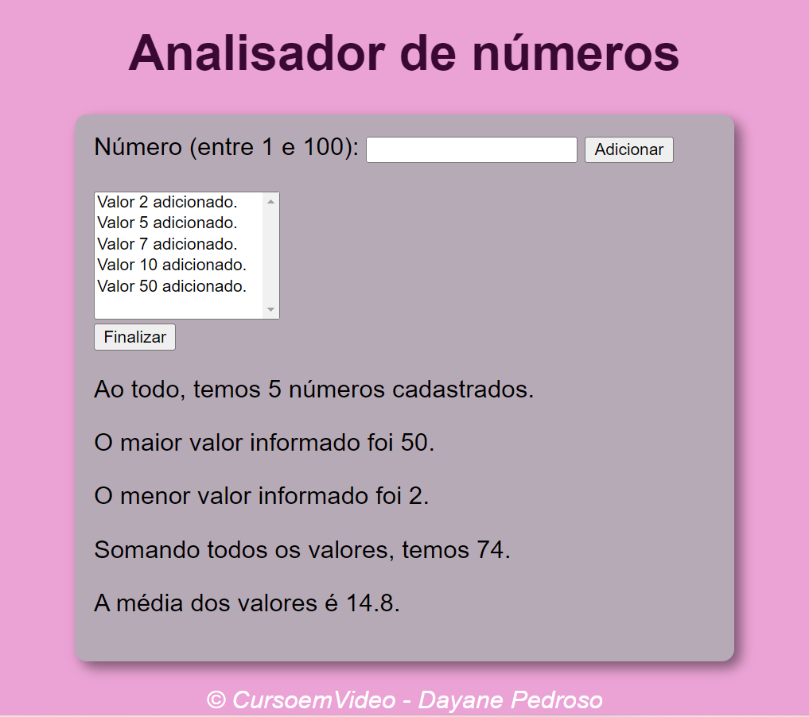

# Analisador de números

Projeto feito juntamente com o professor Gustavo Guanabara durante o curso de JavaScript.
O projeto pode receber diversos números (de 1 a 100) e após verificar mostrará quantidade de números cadastrados, o maior e menor valor informado, a soma e a média dos valores.

